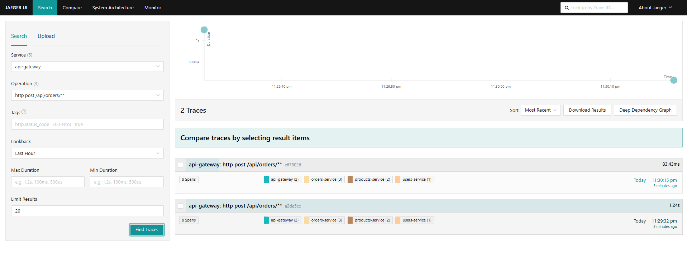

# E-commerce Distributed Platform


A microservices-based e-commerce backend built with Spring Boot, demonstrating distributed systems patterns: service-to-service communication, event-driven messaging, caching, observability, and performance testing under load.

Built as a portfolio project to practice and demonstrate backend engineering beyond a single-service CRUD app.

## Architecture

```
                    ┌─────────────┐
                    │ API Gateway │  :8000
                    └──────┬──────┘
                           │
        ┌──────────────────┼──────────────────┐
        │                  │                  │
        ▼                  ▼                  ▼
 ┌─────────────┐   ┌─────────────┐   ┌──────────────┐
 │Users Service│   │ Products    │   │ Orders       │
 │   :8080     │   │ Service     │   │ Service      │
 │             │   │   :8081     │   │   :8082      │
 └──────┬──────┘   └──────┬──────┘   └──────┬───────┘
        │                 │                  │
        ▼                 ▼                  ▼
   ┌────────┐        ┌────────┐         ┌────────┐
   │users-db│        │products│         │orders-db│
   │Postgres│        │  -db   │         │Postgres │
   └────────┘        │Postgres│         └────────┘
                      └───┬────┘              │
                          ▼                   ▼
                      ┌───────┐          ┌─────────┐
                      │ Redis │          │  Kafka  │
                      │(cache)│          │         │
                      └───────┘          └────┬────┘
                                               │
                                               ▼
                                    ┌──────────────────┐
                                    │Notifications      │
                                    │Service :8083       │
                                    └────────────────────┘
```

Each service owns its own PostgreSQL database (database-per-service pattern). `orders-service` calls `users-service` and `products-service` synchronously via REST to validate a request, then publishes an `OrderCreated` event to Kafka. `notifications-service` consumes that event asynchronously — it has no direct dependency on `orders-service`.

## Tech stack

- **Java 21** / **Spring Boot 3** (Spring Web, Spring Data JPA, Spring Validation, Spring Boot Actuator)
- **Spring Cloud Gateway** — single entry point, routes `/api/users/**`, `/api/products/**`, `/api/orders/**`
- **PostgreSQL** — one instance per service
- **Redis** — read-through cache on the product catalog (`@Cacheable`)
- **Apache Kafka** (KRaft mode) — asynchronous order events; [Kafka UI](https://github.com/provectus/kafka-ui) included for inspecting topics
- **Docker Compose** — full local environment, one command to run everything
- **Prometheus + Grafana** — metrics collection and dashboards (via Micrometer / Actuator)
- **k6** — load and stress testing, with root-cause analysis of a real bottleneck found under load (see [Performance testing](#performance-testing))
## Running it

Requires Docker Desktop.

```bash
git clone https://github.com/AnnaMartina31/ecommerce-platform.git
cd ecommerce-platform
docker compose up -d
```

This starts all services, their databases, Redis, Kafka, Prometheus, and Grafana.

| Service | URL |
|---|---|
| API Gateway | http://localhost:8000 |
| Kafka UI | http://localhost:8090 |
| Prometheus | http://localhost:9090 |
| Grafana | http://localhost:3000 (login: `admin` / `admin`) |

Example request through the gateway:
```bash
curl http://localhost:8000/api/products
```

## Performance testing

The [`k6-tests/`](./k6-tests) folder contains smoke, load, and stress test scripts for both the read path (`GET /api/products`, Redis-cached) and the write path (`POST /api/orders`, which touches two services, Postgres, and Kafka).

Stress testing surfaced a real bottleneck: the default HikariCP connection pool (10 connections) saturated under concurrent order creation, causing request timeouts. The pool size was increased and the fix verified with a clean before/after benchmark comparison.

Full methodology [main](notifications-service/src/main)and numbers are in the sections above and in the scripts under `k6-tests/`.

## Transactional outbox

`orders-service` must save an order and notify the rest of the system. Writing to Postgres and then publishing to Kafka are two separate operations (dual-write): if Kafka is down, or the app stops between the two, the order exists but the event is lost.

To avoid this, the order and its event are saved in the **same database transaction**: the event goes into an `outbox_events` table. A scheduled relay (`OutboxRelay`) reads unpublished rows every second, sends them to Kafka and marks them as published. If Kafka is unreachable, events stay in the table and are retried.

Verified by two integration tests (Testcontainers):
- `OrderOutboxIT`: with Kafka down, the order is created (`201`) and the event stays pending.
- `OrderOutboxRelayIT`: with Kafka up, the relay publishes the event and it appears on the `order-events` topic.

**Trade-off:** delivery is *at-least-once*. If the relay publishes but crashes before marking the row, the event is sent twice, so consumers (e.g. `notifications-service`) must be idempotent.

## Idempotent consumer

Because the outbox guarantees at-least-once delivery, `notifications-service` may receive the same event twice. It records each handled `orderId` in a `processed_events` table (primary key on `order_id`): the first insert succeeds and triggers the notification, a duplicate violates the key and is ignored. Together with the outbox this gives effectively-once processing. Covered by `OrderEventConsumerIT` (Testcontainers), which delivers the same event twice and asserts a single notification.

**Limit:** the mark-as-processed insert and the notification are not atomic; if sending fails after the insert, the event is not retried.

## Resilience: circuit breaker and timeouts on orders-service

**Scenario.** 10 virtual users create orders for 90 s through the gateway. At ~30 s `products-service` is stopped, at ~60 s it is restarted (`k6-tests/orders-resilience-test.js`). `orders-service` calls `products-service` synchronously.

**Before** (no timeouts, no circuit breaker): 1030 orders created, **240 uncontrolled failures** (500s/timeouts), max latency 10 s (the k6 client timeout), avg 210 ms.

**After** (connect 1 s / read 2 s timeouts + Resilience4j circuit breaker): 770 orders created, 858 clean `503 Service Unavailable`, **0 uncontrolled failures**, max latency 2.3 s, avg 44 ms. Once the circuit is open, 503s are returned in a median of 17 ms (p95 30 ms) without touching the network.

**Reading the results.** k6 counts the intentional 503s as failed requests (`http_req_failed` 52.7%); the relevant signal is that every response was either 201 or a fast, explicit 503. Fewer 201s in the second run is expected: the circuit stays open while `products-service` restarts, and the two runs' stop/start timings were not identical, so the 201 counts are not directly comparable.

**Limits.** Single run per variant, manual stop/start timing, local Docker environment.

## Distributed tracing

All services export OpenTelemetry traces to Jaeger (`http://localhost:16686`). A single `POST /api/orders` is one trace spanning api-gateway, orders-service, users-service and products-service.



**Gotcha found along the way:** `UserClient` and `ProductClient` were built with the static `RestClient.builder()`, which skips Spring's instrumentation, so traces stopped at orders-service (1 span). Injecting Spring's `RestClient.Builder` fixed propagation (8 spans, 4 services).

## What's not (yet) included

- Kubernetes deployment (the platform currently runs via Docker Compose only)
- Automated test suite (unit/integration tests exist per-service but aren't wired into CI)
- Distributed tracing (Zipkin/Jaeger)
- Authentication/authorization on the gateway

## Project structure

```
ecommerce-platform/
├── api-gateway/
├── users-service/
├── products-service/
├── orders-service/
├── notifications-service/
├── k6-tests/              # k6 load/stress test scripts
├── docker-compose.yml
├── prometheus.yml
└── README.md
```
